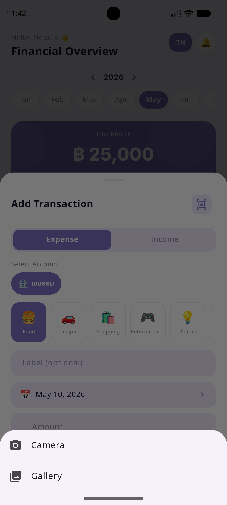
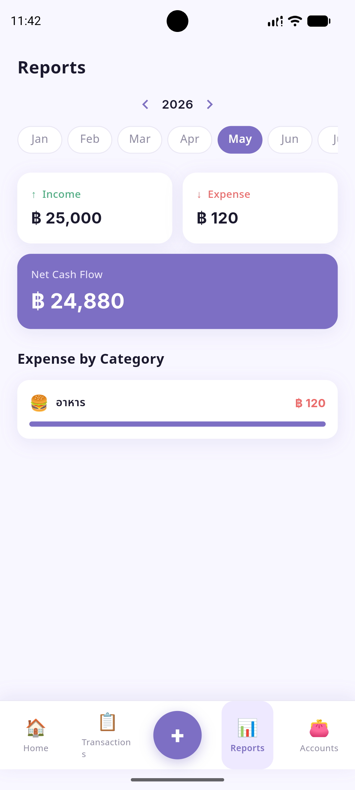

# Paoly 💜🐶

A clean personal finance app with a twist — your spending habits feed a virtual dog.
Track income and expenses, earn coins for every baht you receive, and spend them
on food and accessories for your animated companion.

---

## 🚀 Key Features

### 💰 Finance
- **Smart Slip Scanner** — Auto-extract amount, date, and recipient from bank transfer slips using on-device OCR. Supports K-Plus, MAKE by KBank, SCB, BBL, Krungthai, GSB, ttb, Krungsri, UOB, and CIMB.
- **Multi-account tracking** — Manage multiple accounts (cash, bank, savings, etc.)
- **Income & expense logging** — Add transactions with category, date, and account.
- **Custom categories** — Create your own income/expense categories with emoji icons.
- **Monthly reports** — Spending breakdown by category with visual progress bars.
- **Month & year filtering** — Browse history across any month and year.
- **Bilingual UI** — Thai 🇹🇭 and English 🇬🇧 interface.
- **Privacy first** — All data and OCR processing stay entirely on your device.

### 🐶 น้องหมา — Dog-Raising System
- **10 selectable breeds** — Golden Retriever, French Bulldog, Shiba Inu, Siberian Husky, Poodle, Beagle, Pembroke Welsh Corgi, Dachshund, German Shepherd, Border Collie.
- **Earn coins from income** — Every 100 THB of income = 1 🪙 coin.
- **Real-time hunger system** — Hunger drains continuously (even while the app is closed). Feed your dog to restore it.
- **Mood reflects hunger** — Happy 😊 when full, neutral 😐 when getting hungry, sad 😢 with tears when very hungry.
- **Food shop** — 5 food items (🦴 🥣 🍗 🍖 🥩) at different coin prices and hunger restore amounts.
- **Accessory shop** — Buy and equip 5 accessories (🎀 bow-tie, 🧣 bandana, 🕶️ sunglasses, 🎩 top hat, 👑 crown) rendered live on your dog.
- **Smooth animations** — Procedural dog drawn entirely in code (no image assets): breathing, body bob, tail wag, blinking, ear twitch, gentle sway, and a happy hop when tapped or fed.
- **Persistent state** — Breed, name, coins, hunger, and owned items survive app restarts.

---

## 🇹🇭 คุณสมบัติเด่น

### 💰 การเงิน
- **ระบบอ่านสลิปอัจฉริยะ** — สกัดยอดเงิน วันที่ และชื่อผู้รับจากสลิปโอนเงินด้วย OCR บนเครื่อง รองรับ K-Plus, MAKE by KBank, SCB, BBL, กรุงไทย, ออมสิน, ttb, กรุงศรี, UOB และ CIMB
- **จัดการได้หลายบัญชี** — แยกกระเป๋าเงิน บัญชีธนาคาร หรือเงินออมได้อย่างอิสระ
- **บันทึกรายรับ-รายจ่าย** — พร้อมระบุหมวดหมู่ วันที่ และบัญชีที่ใช้
- **หมวดหมู่ปรับแต่งได้** — เพิ่ม/แก้ไขหมวดหมู่พร้อมไอคอนอิโมจิที่ชอบ
- **สรุปรายงานรายเดือน** — ดูสถิติการใช้จ่ายแยกตามหมวดหมู่
- **ค้นหาประวัติย้อนหลัง** — เลือกดูรายการตามเดือนและปีที่ต้องการ
- **รองรับ 2 ภาษา** — ไทย 🇹🇭 และอังกฤษ 🇬🇧
- **ข้อมูลอยู่ในเครื่อง** — ไม่มีการส่งข้อมูลออกไปภายนอก ปลอดภัย 100%

### 🐶 ระบบเลี้ยงน้องหมา
- **เลือกได้ 10 สายพันธุ์** — โกลเด้น รีทรีฟเวอร์, เฟรนช์ บูลด็อก, ชิบะ อินุ, ไซบีเรียน ฮัสกี้, พุดเดิ้ล, บีเกิล, คอร์กี้, ดัชชุน, เยอรมัน เชเพิร์ด, บอร์เดอร์ คอลลี่
- **ได้ coin จากรายรับ** — ทุกๆ 100 บาทที่บันทึกเป็นรายรับ = 1 🪙 coin
- **ระบบความหิวเรียลไทม์** — ความหิวลดต่อเนื่องแม้ปิดแอป ต้องให้อาหารสม่ำเสมอ
- **สีหน้าบอกอารมณ์** — อิ่มมาก 😊 / เริ่มหิว 😐 / หิวมาก 😢 (มีน้ำตา)
- **ร้านอาหาร** — อาหาร 5 ชนิด ราคาและค่าความอิ่มต่างกัน
- **ร้านเครื่องประดับ** — ซื้อและใส่/ถอดได้ 5 ชิ้น (หูกระต่าย ผ้าพันคอ แว่น หมวก มงกุฎ) แสดงบนตัวหมาจริง
- **อนิเมชั่นธรรมชาติ** — วาดน้องหมาด้วยโค้ดล้วน ไม่ต้องใช้ไฟล์รูปภาพ ขยับตัวลื่นทุกแพลตฟอร์ม
- **บันทึกอัตโนมัติ** — สายพันธุ์ ชื่อ coin ความหิว และของที่ซื้อไว้จะถูกจำแม้ปิดแอป

---

## 📸 Screenshots

| Dashboard | Scan Slip | Reports |
|:---:|:---:|:---:|
|  |  |  |

---

## 🛠️ Tech Stack

| Layer | Technology |
|---|---|
| Framework | Flutter 3.x / Dart 3.x |
| State management | `ChangeNotifier` + `ListenableBuilder` |
| Persistence | `shared_preferences` |
| OCR | `google_mlkit_text_recognition` |
| Barcode | `google_mlkit_barcode_scanning` |
| Font | `google_fonts` (Noto Sans Thai + Inter) |
| Dog rendering | `CustomPainter` (procedural, no assets) |

---

## Getting Started

### Prerequisites

- [Flutter](https://flutter.dev/docs/get-started/install) 3.x or higher
- Dart 3.x

### Installation

```bash
git clone https://github.com/SigmaF001/Paoly.git
cd Paoly
flutter pub get
flutter run
```

### Build for Windows

```bash
flutter build windows
```

---

## 📁 Project Structure

```
lib/
├── data/
│   ├── app_settings.dart   # User preferences (name, language)
│   ├── finance_data.dart   # Accounts, transactions, categories
│   ├── pet_catalog.dart    # Shop catalogue (foods & accessories)
│   └── pet_data.dart       # Pet state (coins, hunger, equipped)
├── models/
│   ├── account.dart
│   ├── category.dart
│   ├── dog_breed.dart      # 10 breed definitions (colours, ears, coat)
│   ├── pet_items.dart      # FoodItem & Accessory models
│   └── transaction.dart
├── screens/
│   ├── accounts_screen.dart
│   ├── dashboard_screen.dart
│   ├── onboarding_screen.dart
│   ├── pet_screen.dart     # Breed selection + pet home + shop sheets
│   ├── reports_screen.dart
│   └── transactions_screen.dart
├── services/
│   └── slip_scanner_service.dart
├── theme/app_theme.dart
├── l10n/app_strings.dart
├── utils/
│   ├── formatter.dart
│   └── sounds.dart
└── widgets/
    ├── add_transaction_sheet.dart
    ├── dog_view.dart           # Animated procedural dog (CustomPainter)
    ├── emoji_picker_grid.dart
    └── year_month_selector.dart
```

---

## License

MIT
